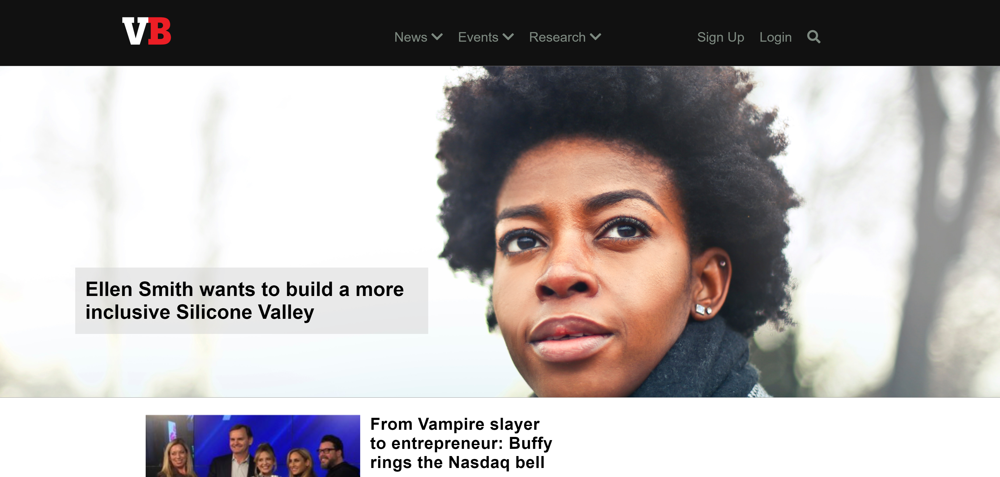

# Venture-Beat

Live Code: https://kimflores-venturebeat.netlify.app

# How It's Made:
### Tech used: 
My task was to replicate the Venture Beat homepage with **HTML** and **CSS**. I was given a screenshot as reference and implemented media queries for responsiveness. 

# Lessons Learned:
Building this site was more straightforward to the other sites however, it helped with understanding media queries better and how to organize the content. Got more familiar using CSS display:none property to hide li in the navigation bar and reveal them in "Mobile First" design.

# Examples:
Take a look at these couple examples that I have in my own portfolio:

BBC: https://github.com/Kim-Flores/

Yelp: https://github.com/Kim-Flores/Yelp

Level Ground: https://github.com/Kim-Flores/Level-ground

JWLI: https://github.com/Kim-Flores/JWLI
